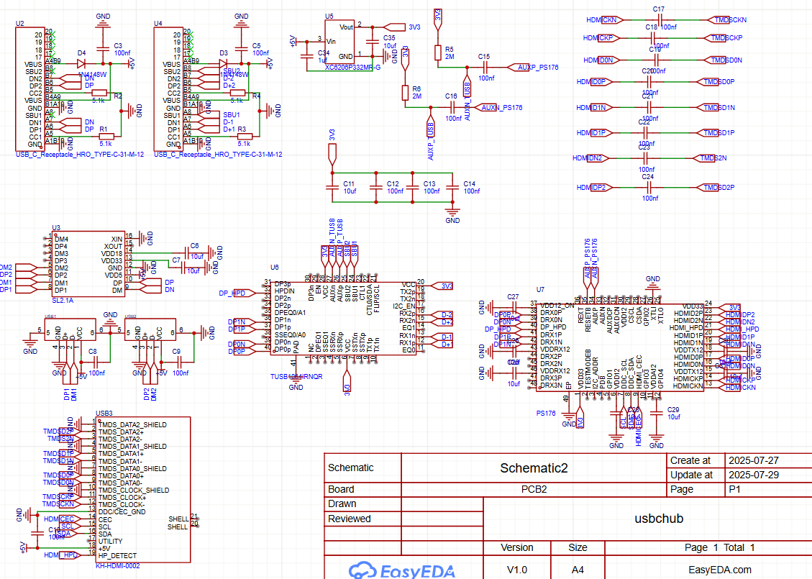
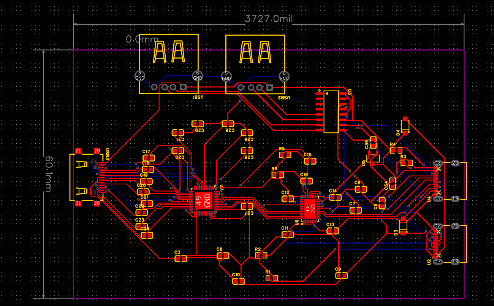
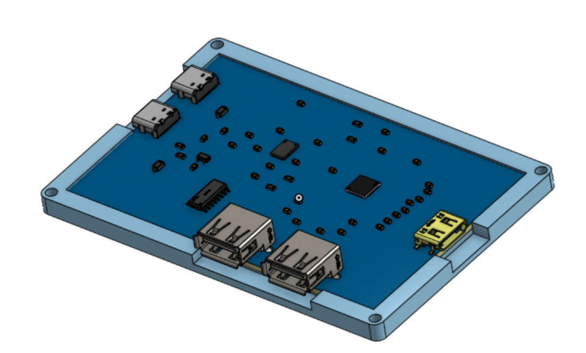

# GhostHub

A compact board that combines a USB‑C hub and an HDMI‑over‑DisplayPort port in one enclosure.

---

## Main components

- **Two USB‑C ports**  
  - **Upstream**: Connect to your host via a standard USB‑A→USB‑C cable.  
  - **Downstream**: two USB A ports.

- **HDMI output via DisplayPort Alt‑Mode**  
  - Uses a TUSB1064 redriver and a Parade PS176 DP→HDMI converter.  
---

## Schematic

---

## PCB

---

## Case & CAD

## BOM
| Item | Quantity | Link | Price|
|---------|--------------|---------------|-----------|
|  PCBA | 5 | Order from JLCPCB | around $50|
| tusb1064| 1| [link](https://lcsc.com/product-detail/USB-Converters_TI-TUSB1064IRNQR_C2675165.html?s_z=n_tusb1064)|$ 11 |
| ps176 parade technologies| 1| [link](https://www.amazon.com/1pieces-PS176-QFN-48-EP-6x6/dp/B0F5NXVFG7)| $20 |
